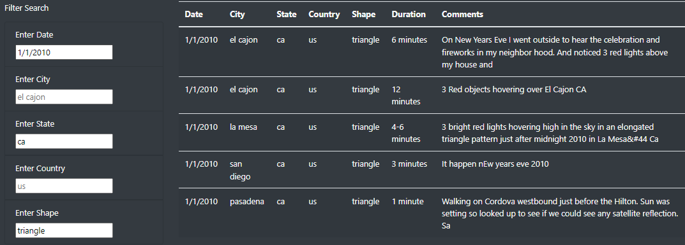

# UFOs

## Project Overview
This project involves building a webpage that allows users to search through UFO sightings across the world, and can filter the results based on desired date, location, or shape of sighting. 

By utilizing JavaScript, HTML, and CSS, filters were added to the webpage that check for matches in the data file, and a listener event checks for these updates in real-time to immediately filter the results based on user input. 

## Results
If you'd like to search through the data, simply type in the criteria in the relevant field. The empty filters give suggestions on what to search for if you are unsure where to start. 

Let's start by searching for New Year's Day. By typing 1/1/2010 in to the "enter date" field, our search yields 34 results (the first 8 of which are displayed below). The results may not load until you click outside the field or press enter. 

It takes a while to scroll through this list and make sense of any patterns, so let's focus on just one area. Filtering to California cuts our results down to just 16.

After filtering by triangle as the shape, we get five manageable results. By comparing the comments, we can see that three of these sightings describe 3 red lights, so they were likely seeing the same object. What could it have been? Do you think they really spotted aliens?

## Summary

### Drawbacks
These filters only check for exact matches when compared against the data. That is, a date of 01/05/2010 will not match 1/5/10, even though these are the same date. Likewise, entering in a full state name (like "California") will not match the data entries of "ca" and a user may think that there are no matches for their entries, when it is just not formatted correctly. 

### Potential Improvements
We could expand this project for further development. A couple suggestions for changes that would improve our webpage:

- The data itself could be reformatted. This would include using capitalization for city names, and state and country abbreviations, as well as converting the duration so the times all appear more consistently, instead of some of them using "5 mins." or "12 minutes" or "half an hour." 

- For the "shape" of UFO sighting, instead of having the user type in their input, this filter could be adjusted to a drop-down list of the shapes that appear in the data file. This way, if a user isn't sure what shape they want to look for, they can see all of the possibilities. This could also be done for the "city" field, as some cities may be entered as a larger nearby city (entering a sighting in Beaverton as Portland, for example). 

- By incorporating Google Maps API, we can plot these sightings on a map, allowing the user to visually see the pattern of sightings by location. They could still filter the results by other values, but having a map would allow users to pick based on a marker on the map instead of typing in a city or state, or by choosing one from a drop-down list. 

- Another upgrade to this site would be adding drop down menus for each column to be able to sort by state or country alphabetically. If a user does not know the abbreviation they are looking for, and wants to see what kind of data exists without typing in every state or country code they can think of, having a sorting function for each column would be helpful to browse through the data at a glance. 